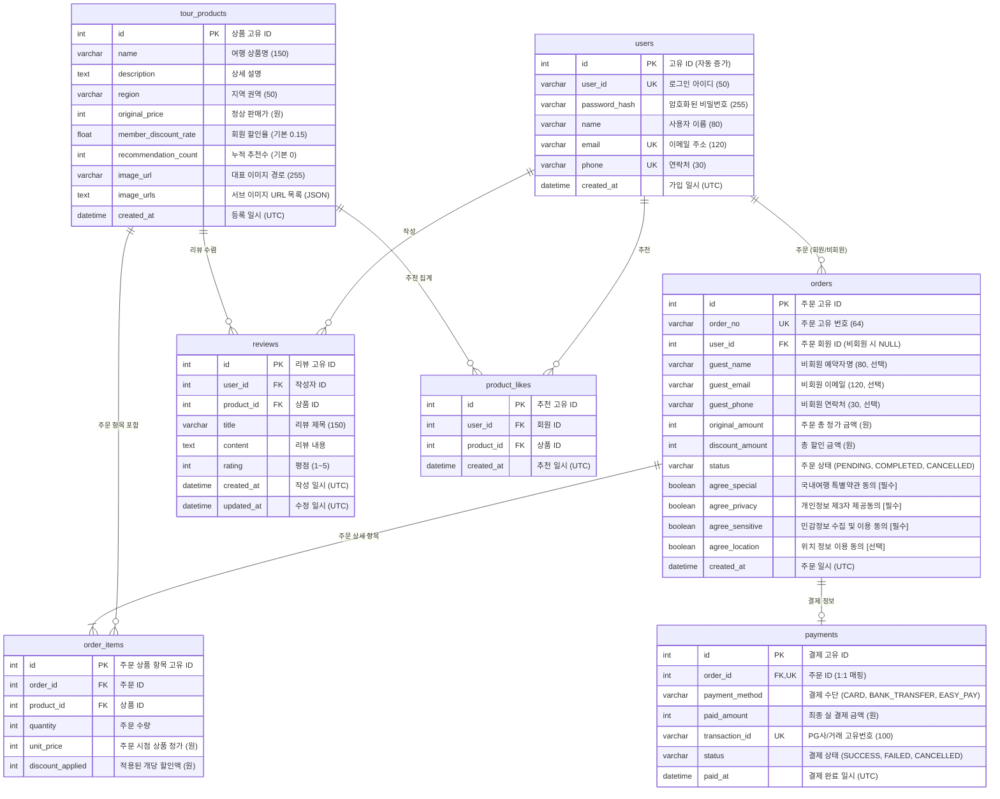

# 데이터베이스 E-R 다이어그램 (ERD)

본 문서는 **대한민국 구석구석 국내 여행 패키지 예약 서비스**의 데이터 모델 구조와 테이블 간 관계를 정의한 데이터베이스 명세서입니다.

---

## 1. 개체-관계 다이어그램 (Entity-Relationship Diagram)

---

## 2. 테이블 간 관계 정의 (Relationships)

| 부모 테이블 (Parent)        | 자식 테이블 (Child) | 관계 차수 (Cardinality) | 외래키 (Foreign Key)         | 삭제 정책 (On Delete) | 비고                                           |
| :-------------------------- | :------------------ | :---------------------: | :--------------------------- | :-------------------- | :--------------------------------------------- |
| **`users`**         | `orders`          |    `1 : N` (0..N)    | `orders.user_id`           | `CASCADE`           | 비회원 주문 지원 (`user_id`가 `NULL` 가능) |
| **`users`**         | `reviews`         |    `1 : N` (0..N)    | `reviews.user_id`          | `CASCADE`           | 회원 탈퇴 시 작성한 리뷰 자동 삭제             |
| **`users`**         | `product_likes`   |    `1 : N` (0..N)    | `product_likes.user_id`    | `CASCADE`           | 복합 고유키로 1인 1상품 1회 추천 제한          |
| **`tour_products`** | `reviews`         |    `1 : N` (0..N)    | `reviews.product_id`       | `CASCADE`           | 상품 삭제 시 리뷰 연쇄 삭제                    |
| **`tour_products`** | `product_likes`   |    `1 : N` (0..N)    | `product_likes.product_id` | `CASCADE`           | 상품 삭제 시 추천 내역 연쇄 삭제               |
| **`tour_products`** | `order_items`     |    `1 : N` (0..N)    | `order_items.product_id`   | `RESTRICT`          | 주문 이력 보존을 위해 상품 삭제 제한           |
| **`orders`**        | `order_items`     |    `1 : N` (1..N)    | `order_items.order_id`     | `CASCADE`           | 주문 삭제 시 주문 상세 항목 연쇄 삭제          |
| **`orders`**        | `payments`        |    `1 : 1` (0..1)    | `payments.order_id`        | `CASCADE`           | `order_id`에 Unique 제약조건 부여 (1:1 보장) |

---

## 3. 상세 테이블 명세 (Entity Specifications)

### 3.1. `users` (회원 테이블)

- **설명**: 서비스에 가입한 일반 회원 정보 관리
- **SQLAlchemy 모델**: `User`

| 컬럼명            | 논리명        | 데이터 타입      | 제약 조건               | 기본값      | 설명                        |
| :---------------- | :------------ | :--------------- | :---------------------- | :---------- | :-------------------------- |
| `id`            | 회원 고유번호 | `INTEGER`      | PK, AUTO_INCREMENT      | -           | 내부 식별자                 |
| `user_id`       | 로그인 아이디 | `VARCHAR(50)`  | NOT NULL, UNIQUE, INDEX | -           | 사용자 로그인 ID            |
| `password_hash` | 비밀번호 해시 | `VARCHAR(255)` | NOT NULL                | -           | Werkzeug 해시 암호화 문자열 |
| `name`          | 사용자 이름   | `VARCHAR(80)`  | NOT NULL                | -           | 회원 실명                   |
| `email`         | 이메일        | `VARCHAR(120)` | NOT NULL, UNIQUE, INDEX | -           | 계정 이메일                 |
| `phone`         | 연락처        | `VARCHAR(30)`  | NOT NULL, UNIQUE        | -           | 휴대폰 번호                 |
| `created_at`    | 가입일시      | `DATETIME`     | NOT NULL                | `UTC NOW` | 회원 가입 일시              |

---

### 3.2. `tour_products` (여행 상품 테이블)

- **설명**: 6대 권역별 패키지 여행 상품 정보 및 할인 정책 관리
- **SQLAlchemy 모델**: `TourProduct`

| 컬럼명                   | 논리명           | 데이터 타입      | 제약 조건          | 기본값               | 설명                                    |
| :----------------------- | :--------------- | :--------------- | :----------------- | :------------------- | :-------------------------------------- |
| `id`                   | 상품 고유번호    | `INTEGER`      | PK, AUTO_INCREMENT | -                    | 상품 식별자                             |
| `name`                 | 상품명           | `VARCHAR(150)` | NOT NULL, INDEX    | -                    | 여행 상품 타이틀                        |
| `description`          | 상품 설명        | `TEXT`         | NOT NULL           | -                    | 일정 및 패키지 상세 안내                |
| `region`               | 권역             | `VARCHAR(50)`  | NOT NULL, INDEX    | -                    | 서울/경기, 전라, 충청, 강원, 경북, 제주 |
| `original_price`       | 상품 정가        | `INTEGER`      | NOT NULL           | -                    | 1인 기준 기본 판매 금액 (원)            |
| `member_discount_rate` | 회원 할인율      | `FLOAT`        | -                  | `0.15`             | 회원 결제 시 적용되는 할인 비율 (15%)   |
| `recommendation_count` | 추천수           | `INTEGER`      | INDEX              | `0`                | 누적 하트/좋아요 개수                   |
| `image_url`            | 대표 이미지      | `VARCHAR(255)` | -                  | `default-tour.jpg` | 메인 썸네일 경로                        |
| `image_urls`           | 상세 이미지 목록 | `TEXT`         | NULLABLE           | -                    | 상품 상세 캐러셀용 JSON 배열 문자열     |
| `created_at`           | 상품 등록일시    | `DATETIME`     | -                  | `UTC NOW`          | 상품 생성 일시                          |

---

### 3.3. `product_likes` (상품 추천 테이블)

- **설명**: 사용자와 여행 상품 간의 다대다(N:M) 추천 매핑 테이블
- **SQLAlchemy 모델**: `ProductLike`
- **복합 고유키 제약조건**: `UNIQUE(user_id, product_id)` (중복 추천 방지)

| 컬럼명         | 논리명        | 데이터 타입  | 제약 조건                           | 기본값      | 설명             |
| :------------- | :------------ | :----------- | :---------------------------------- | :---------- | :--------------- |
| `id`         | 추천 고유번호 | `INTEGER`  | PK, AUTO_INCREMENT                  | -           | 식별자           |
| `user_id`    | 회원 ID       | `INTEGER`  | FK (`users.id`), NOT NULL         | -           | 추천을 누른 회원 |
| `product_id` | 상품 ID       | `INTEGER`  | FK (`tour_products.id`), NOT NULL | -           | 추천 대상 상품   |
| `created_at` | 추천 일시     | `DATETIME` | -                                   | `UTC NOW` | 추천 누른 시간   |

---

### 3.4. `reviews` (상품 리뷰 테이블)

- **설명**: 여행 상품에 대해 회원이 작성한 이용 후기 및 평점
- **SQLAlchemy 모델**: `Review`

| 컬럼명         | 논리명        | 데이터 타입      | 제약 조건                           | 기본값      | 설명                |
| :------------- | :------------ | :--------------- | :---------------------------------- | :---------- | :------------------ |
| `id`         | 리뷰 고유번호 | `INTEGER`      | PK, AUTO_INCREMENT                  | -           | 식별자              |
| `user_id`    | 회원 ID       | `INTEGER`      | FK (`users.id`), NOT NULL         | -           | 리뷰 작성 회원      |
| `product_id` | 상품 ID       | `INTEGER`      | FK (`tour_products.id`), NOT NULL | -           | 리뷰 대상 여행 상품 |
| `title`      | 리뷰 제목     | `VARCHAR(150)` | NOT NULL                            | -           | 후기 한 줄 제목     |
| `content`    | 리뷰 본문     | `TEXT`         | NOT NULL                            | -           | 상세 이용 후기 내용 |
| `rating`     | 평점          | `INTEGER`      | NOT NULL                            | `5`       | 별점 점수 (1 ~ 5)   |
| `created_at` | 작성 일시     | `DATETIME`     | -                                   | `UTC NOW` | 작성 일시           |
| `updated_at` | 수정 일시     | `DATETIME`     | -                                   | `UTC NOW` | 최종 수정 일시      |

---

### 3.5. `orders` (주문 테이블)

- **설명**: 회원 및 비회원의 여행 예약 주문 내역과 약관 동의 내역 관리
- **SQLAlchemy 모델**: `Order`

| 컬럼명              | 논리명             | 데이터 타입      | 제약 조건                   | 기본값        | 설명                                              |
| :------------------ | :----------------- | :--------------- | :-------------------------- | :------------ | :------------------------------------------------ |
| `id`              | 주문 고유번호      | `INTEGER`      | PK, AUTO_INCREMENT          | -             | 내부 식별자                                       |
| `order_no`        | 주문 식별 코드     | `VARCHAR(64)`  | NOT NULL, UNIQUE, INDEX     | -             | 비즈니스 주문번호 (`ORD-YYYYMMDDHHMMSS-XXXXXX`) |
| `user_id`         | 회원 ID            | `INTEGER`      | FK (`users.id`), NULLABLE | `NULL`      | 주문 회원 (비회원 주문 시 NULL)                   |
| `guest_name`      | 비회원 주문자명    | `VARCHAR(80)`  | NULLABLE                    | -             | 비회원 예약 시 대표자명                           |
| `guest_email`     | 비회원 이메일      | `VARCHAR(120)` | NULLABLE                    | -             | 비회원 알림 수신용 이메일                         |
| `guest_phone`     | 비회원 연락처      | `VARCHAR(30)`  | NULLABLE                    | -             | 비회원 긴급 연락용 휴대폰 번호                    |
| `original_amount` | 정상 주문 총액     | `INTEGER`      | NOT NULL                    | -             | 할인 적용 전 상품 총 정가 금액 (원)               |
| `discount_amount` | 총 할인 금액       | `INTEGER`      | -                           | `0`         | 회원 15% 할인 등 적용된 총 할인액 (원)            |
| `status`          | 주문 진행 상태     | `VARCHAR(20)`  | -                           | `COMPLETED` | `PENDING`, `COMPLETED`, `CANCELLED`         |
| `agree_special`   | 특별약관 동의      | `BOOLEAN`      | NOT NULL                    | `True (1)`  | 국내여행 특별약관 동의`[필수]`                  |
| `agree_privacy`   | 제3자 제공 동의    | `BOOLEAN`      | NOT NULL                    | `True (1)`  | 개인정보 제3자 제공동의`[필수]`                 |
| `agree_sensitive` | 민감정보 수집 동의 | `BOOLEAN`      | NOT NULL                    | `True (1)`  | 민감정보 수집 및 이용 동의`[필수]`              |
| `agree_location`  | 위치정보 이용 동의 | `BOOLEAN`      | NOT NULL                    | `False (0)` | 위치 정보 이용 동의`[선택]`                     |
| `created_at`      | 주문 생성일시      | `DATETIME`     | -                           | `UTC NOW`   | 주문 일시                                         |

---

### 3.6. `order_items` (주문 상품 상세 항목 테이블)

- **설명**: 한 건의 주문(`Order`)에 포함된 여행 상품, 인원(수량), 주문 시점 단가
- **SQLAlchemy 모델**: `OrderItem`

| 컬럼명               | 논리명           | 데이터 타입 | 제약 조건                           | 기본값 | 설명                              |
| :------------------- | :--------------- | :---------- | :---------------------------------- | :----- | :-------------------------------- |
| `id`               | 상세 고유번호    | `INTEGER` | PK, AUTO_INCREMENT                  | -      | 식별자                            |
| `order_id`         | 주문 ID          | `INTEGER` | FK (`orders.id`), NOT NULL        | -      | 부모 주문 식별자                  |
| `product_id`       | 상품 ID          | `INTEGER` | FK (`tour_products.id`), NOT NULL | -      | 주문한 여행 상품 식별자           |
| `quantity`         | 예약 인원수      | `INTEGER` | NOT NULL                            | `1`  | 예약 여행객 인원수 (기본 1)       |
| `unit_price`       | 주문 시점 단가   | `INTEGER` | NOT NULL                            | -      | 주문 확정 당시 상품 1인 정가 (원) |
| `discount_applied` | 인당 할인 적용액 | `INTEGER` | -                                   | `0`  | 주문 시점 인당 할인 금액 (원)     |

---

### 3.7. `payments` (결제 내역 테이블)

- **설명**: 주문 건에 대해 결제 승인된 트랜잭션 및 결제 수단 정보 관리
- **SQLAlchemy 모델**: `Payment`
- **1:1 제약조건**: `order_id` 컬럼에 `UNIQUE` 제약조건이 적용되어 주문 1건당 결제 1건 매핑 보장

| 컬럼명             | 논리명         | 데이터 타입      | 제약 조건                            | 기본값      | 설명                                                          |
| :----------------- | :------------- | :--------------- | :----------------------------------- | :---------- | :------------------------------------------------------------ |
| `id`             | 결제 고유번호  | `INTEGER`      | PK, AUTO_INCREMENT                   | -           | 내부 식별자                                                   |
| `order_id`       | 주문 ID        | `INTEGER`      | FK (`orders.id`), UNIQUE, NOT NULL | -           | 대상 주문 식별자                                              |
| `payment_method` | 결제 수단      | `VARCHAR(30)`  | -                                    | `CARD`    | `CARD`(신용/체크카드), `BANK_TRANSFER`, `EASY_PAY`      |
| `paid_amount`    | 최종 결제 금액 | `INTEGER`      | NOT NULL                             | -           | 실 승인 결제 금액 (`original_amount` - `discount_amount`) |
| `transaction_id` | 결제 거래번호  | `VARCHAR(100)` | NOT NULL, UNIQUE                     | -           | PG사 거래 식별 고유번호                                       |
| `status`         | 결제 처리 상태 | `VARCHAR(20)`  | -                                    | `SUCCESS` | `SUCCESS`, `FAILED`, `CANCELLED`                        |
| `paid_at`        | 결제 승인일시  | `DATETIME`     | -                                    | `UTC NOW` | 결제 승인 일시                                                |

---

## 4. 비즈니스 로직 및 무결성 규칙 (Business Rules)

1. **회원 / 비회원 예약 지원**
   - 회원이 예약 시 `Order.user_id`에 회원 번호가 기록되며 기본 15%의 회원 할인이 적용됩니다.
   - 비회원이 예약 시 `Order.user_id`는 `NULL`로 저장되며, `guest_name`, `guest_email`, `guest_phone` 컬럼에 비회원 예약자 정보가 기록됩니다.
2. **약관 및 동의 상태 관리**
   - 결제 진행 시 필수 동의 3건(`agree_special`, `agree_privacy`, `agree_sensitive`)은 반드시 `True`여야 결제가 허용됩니다.
   - `agree_location`(위치정보 이용)은 선택 사항으로 주문 시점 사용자의 선택 값에 따라 저장됩니다.
3. **금액 계산 일관성**
   - `Order.final_amount` = `original_amount` - `discount_amount`
   - `Payment.paid_amount`는 `Order.final_amount`와 일치해야 정상 결제로 승인됩니다.
4. **캐스케이드(Cascade) 삭제 정책**
   - 회원 탈퇴 시 해당 회원의 추천(`product_likes`), 리뷰(`reviews`), 주문 내역(`orders`)은 연쇄 삭제(`CASCADE`) 처리됩니다.
   - 주문 삭제 시 연계된 주문 상세(`order_items`)와 결제 정보(`payments`) 역시 연쇄 삭제(`CASCADE`)됩니다.
   - 여행 상품(`tour_products`) 삭제 시 과거 결제/주문 이력 보존을 위해 `order_items`의 상품 참조는 보호됩니다.
