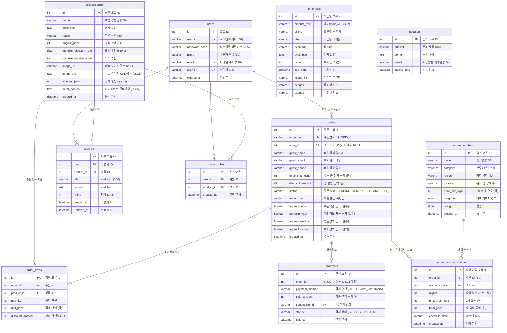

# 🌿 길마중 (Gilmajung Tour)

> **대한민국 구석구석을 잇는 올인원 국내 여행 패키지 예약 & 후기 플랫폼**  
> 6대 권역별 테마 여행 상품 탐색부터 맞춤형 연계 숙박 선택, 간편 전자결제 및 실제 여행객 중심의 리뷰 관리까지 원스톱으로 지원합니다.

---

## 📌 목차
1. [프로젝트 소개](#-프로젝트-소개)
2. [주요 기능 및 화면 구성](#-주요-기능-및-화면-구성)
3. [사용 기술](#-사용-기술)
4. [프로젝트 구조](#-프로젝트-구조)
5. [데이터베이스 E-R 다이어그램 (ERD)](#-데이터베이스-e-r-다이어그램-erd)
6. [실행 방법 (DB 초기화 및 Seed 포함)](#-실행-방법-db-초기화-및-seed-포함)
7. [주의 사항](#-주의-사항)
8. [향후 추가 및 업데이트 가능한 기능](#-향후-추가-및-업데이트-가능한-기능)

---

## 📖 프로젝트 소개

- **프로젝트 이름**: 길마중 (Gilmajung Tour)
- **한 줄 소개**: 수도권·강원·충청·경상·전라·제주 6대 권역별 대화형 여행 상품 추천과 숙박 연계 예약, 전자결제 및 투명한 여행자 후기 시스템을 제공하는 파이썬 플라스크(Flask) 기반 국내 여행 웹 플랫폼입니다.

---

## ✨ 주요 기능 및 화면 구성

### 1. 메인 포털 화면 (`/`)
- **비주얼 배너 슬라이더**: 계절감과 감성을 담은 여행지 풀스크린 배너 및 큐레이션 타이틀 제공
- **6대 권역 퀵 네비게이션**: 수도권, 강원, 충청, 경상, 전라, 제주 권역으로 즉시 이동 가능한 원형 아이콘
- **M타임딜 (실시간 카운트다운)**: 마감 시한이 정해진 특가 패키지를 메인 1건, 서브 2건으로 분할 전시하며 남은 시간을 실시간 초 단위로 계산
- **여행자 후기 프리뷰**: 최신 등록된 리뷰를 최대 5건까지 카드 형태로 요약 노출하며 '후기 전체보기' 연동
- **공지사항 & 고객센터 푸터**: 중요 공지 및 고객센터 이용 시간 안내

### 2. 권역별 상품 탐색 화면 (`/product/main_product`)
- **대화형 SVG 권역 지도**: 마우스 호버 시 지역별 강조 효과 및 클릭 시 해당 권역 상품 즉시 필터링
- **Sticky 지도 레이아웃**: 상품 목록이 많아 스크롤을 내려도 왼쪽의 권역 지도와 탭이 상단에 고정
- **반응형 뷰포트 최적화**:
  - 데스크톱(1025px 이상): 왼쪽 지도(330px) + 오른쪽 2열 상품 그리드
  - 태블릿(769px ~ 1024px): 왼쪽 지도(320px) + 오른쪽 1열 상품 그리드
  - 모바일(768px 이하): 상단 중앙 지도 + 하단 1열 상품 카드 배치

### 3. 상품 상세 및 일정 안내 화면 (`/product/sub_product/<id>`)
- **멀티 썸네일 스와이퍼(Swiper.js)**: 4장의 고화질 사진 갤러리 및 섬네일 내비게이션
- **상세 일정 타임라인**: 시간대별 집결, 오전 관광, 향토 미식, 오후 문화 체험, 복귀 일정 카드
- **투어 하이라이트 & 포함/불포함 내역**: 여행 준비사항 및 핵심 포인트 구조화 안내
- **예약 인원 선택 & 회원 할인 안내**: 회원 15% 기본 할인율 실시간 반영

### 4. 예약 신청 화면 (`/order/reserve`)
- **대표 예약자 정보**: 로그인 회원의 경우 자동 완성, 비회원 예약 시 성명/연락처/이메일 수기 입력
- **동행 여행객 명단**: 신청 인원수(1~10명)에 맞춰 성명 및 성별을 개별 입력받는 폼 동적 렌더링
- **4대 약관 동의**: 국내여행 특별약관[필수], 개인정보 제3자 제공[필수], 민감정보 수집이용[필수], 위치기반 서비스[선택]

### 5. 주문 결제 및 연계 숙박 선택 화면 (`/order/payment`)
- **회원 전용 연계 숙박 옵션**: 투어 상품 권역에 해당하는 추천 호텔 및 감성 민박 목록을 확인하고 1박 연계 예약 추가 지원
- **PortOne V2 전자결제 연동**: 신용카드, 간편결제, 계좌이체 등 모의/실거래 결제창 호출 및 승인
- **실시간 결제 금액 자동 집계**: 투어 상품가 + 동행 인원 + 숙박 요금을 합산한 최종 결제 금액 산출

### 6. 예약 완료 및 영수증 화면 (`/order/complete`)
- **예약 및 결제 요약 카드**: 고유 주문번호(`ORD-...`), 결제 수단, 최종 결제 금액, 약관 동의 내역 표시
- **연계 숙박 및 동행자 요약**: 함께 예약된 숙박 시설 정보 및 동행인 명단 정리
- **인근 추천 관광지 슬라이더**: 같은 권역의 연관 명소를 추가 추천
- **원클릭 액션 버튼**: 'Review 작성/수정' 및 '상세 내역확인하기' 바로가기 제공

### 7. 예약 확인 및 내역 조회 화면 (`/order/lookup`)
- **회원 예약 목록 (아코디언)**:
  - 최신순 예약 목록을 접이식 카드로 표시
  - 헤더 영역에 상태 배지(예약확정/결제대기/취소)와 함께 **단 1개의 'Review 작성' 또는 'Review 수정' 버튼** 노출
  - '상세 정보 ▼' 클릭 시 결제 영수증, 동행인, 숙박 정보 및 인근 추천 명소 상세 노출
- **비회원 단건 예약 조회**:
  - 예약 시 입력한 **예약자 성함**과 **주문번호** 대조를 통해 안전하게 단건 조회

### 8. 여행 후기 커뮤니티 (`/review/...`)
- **후기 작성 권한 제어**: 취소되지 않은 예약을 보유한 회원에 한해 자신이 다녀온 상품에만 후기 작성 허용
- **후기 수정 및 갱신**: 본인이 작성한 후기는 언제든 내용 및 별점 수정이 가능하며, 수정 시각(`updated_at`)으로 자동 갱신
- **목록 UI 특화**: 후기 목록에서는 본문 노출에 집중하고, 카드 클릭 후 상세 화면(`/review/detail/<id>`)에 진입했을 때 제목을 강조 출력
- **이달의 베스트 후기**: 리뷰가 가장 많이 누적된 TOP 3 상품 배너 노출 및 권역별 필터/검색 기능 제공

### 9. 회원 인증 및 계정 관리 (`/auth/...`)
- **회원가입**: 아이디, 이메일, 연락처 중복 검증 및 비밀번호 암호화 저장
- **로그인 & 로그아웃**: 세션 기반 인증 및 이전 작업 페이지 복귀(Safe Next Redirect)
- **카카오 OAuth 소셜 로그인**: 카카오 계정을 통한 간편 로그인/회원가입 지원

### 10. 고객센터 (`/customer/...`)
- **자주 묻는 질문 (FAQ)**: 예약, 결제, 취소/환불 등 자주 묻는 질문 아코디언 열람
- **1:1 문의 작성 & 내역 열람**: 문의사항 등록 및 본인 이메일로 접수된 문의 내역만 열람 가능한 프라이버시 보호

---

## 🛠 사용 기술

| 구분 | 기술 스택 | 설명 |
| :--- | :--- | :--- |
| **Backend** | Python 3.12 | 애플리케이션 핵심 언어 |
| | Flask 3.1.3 | 경량 및 확장형 마이크로 웹 프레임워크 |
| | Flask-SQLAlchemy 3.1.1 | Pythonic ORM 데이터베이스 제어 |
| | Flask-Migrate 4.1.0 | Alembic 기반 데이터베이스 스키마 마이그레이션 |
| | Flask-WTF 1.3.0 / WTForms | 웹 폼 유효성 검증 및 CSRF 보안 |
| | Werkzeug 3.1.8 | WSGI 유틸리티 및 비밀번호 해싱 (`pbkdf2:sha256`) |
| | Authlib 1.8.0 | 카카오 OAuth 2.0 소셜 인증 연동 |
| **Frontend** | HTML5 / CSS3 | 시맨틱 마크업 및 현대적 스타일링 |
| | JavaScript (ES6+) | 비동기 UI 제어 및 모달, 탭, 타이머, 캔버스 인터랙션 |
| | Bootstrap 5.3 | 반응형 그리드 및 UI 컴포넌트를 활용한 **CSS 구조 단순화** |
| | HTML5 Canvas | 지도 구분선 기반 권역 선택 및 플러드필(Flood Fill) 렌더링 |
| | Swiper.js | 터치 지원 모바일 친화적 이미지 캐러셀 |
| **Translation** | Google 번역 API | 실시간 페이지 다국어(한국어, 영어, 일본어, 중국어) 번역 연동 |
| **Database** | SQLite 3 | 로컬 개발 및 파일 기반 관계형 데이터베이스 |
| | (확장 가능) MySQL / MariaDB | 운영 전환 지원을 위한 SQLAlchemy 표준 스키마 설계 |
| **Payment** | PortOne V2 API | 전자결제 모듈 연동 (**테스트 편의를 위해 Comment/Mock 처리**) |
| **DevOps & Tool** | Git | 소스 코드 버전 관리 |
| | python-dotenv | 환경 변수 관리 (`.flaskenv`) |

### 💡 기술 적용 세부 내역 (Technical Details)
- **Google 번역 API를 통한 Language 변경 기능 추가**:
  - `Google Translate Element API`를 GNB 헤더에 탑재하여 원클릭으로 4개 국어(한국어, English, 日本語, 简体中文) 실시간 페이지 번역을 지원합니다.
  - 커스텀 드롭다운 메뉴와 Google Translate의 번역 위젯을 자바스크립트로 연동하여 기본 번역 바의 투박함을 가리고 세련된 글로벌 UI를 구현했습니다.
- **권역별 지도의 지역 구분선에 따른 지역 선택 기능 추가**:
  - `HTML5 Canvas` 및 픽셀 기반 플러드 필(Flood Fill) 정밀 시드 좌표 알고리즘을 적용하여 지도 이미지의 지역 구분선을 기준으로 권역(수도권, 강원, 충청, 경상, 전라, 제주)을 감지합니다.
  - 마우스 호버 시 해당 권역의 하이라이트 색상 반전 효과를 지원하며, 구분선 안쪽 클릭 시 해당 권역의 상품 탭 및 슬라이드 배너가 유기적으로 자동 전환됩니다.
- **PortOne 전자결제 기능 추가 (Comment/Mock 처리)**:
  - PortOne(구 아임포트) V2 SDK를 기반으로 신용/체크카드, 간편결제 등 전자결제 연동 프로세스를 구축했습니다.
  - 개발 및 평가 환경에서 실제 과금 없이 모든 예약 프로세스를 원활하게 검증할 수 있도록 **모의 승인(Mock Payment) 모드로 처리**하였으며, 실제 상용 가맹점 Store ID 및 Channel Key를 주입하여 즉시 실결제로 전환할 수 있도록 결제 호출 코드를 주석(Comment)으로 완비했습니다.
- **Bootstrap을 이용한 CSS 단순화 및 최적화**:
  - Bootstrap 5.3의 Flexbox 유틸리티, 반응형 그리드(`row`, `col`), 카드(`card`), 아코디언(`accordion`), 배지(`badge`) 컴포넌트를 적극 도입하여 기존의 길고 복잡했던 커스텀 CSS 코드를 대폭 감축하고 단순화했습니다.
  - 브랜드 아이덴티티 색상인 네이비(`#1D3557`)를 중심으로 CSS 변수(`--bs-primary`)를 재정의하여 일관된 톤앤매너와 높은 코드 가독성을 확보했습니다.

---

## 📂 프로젝트 구조

```text
div-flask/
├── config.py                     # 데이터베이스 URI, 시크릿 키 등 기본 설정 파일
├── requirements.txt              # 파이썬 의존성 패키지 명세서
├── seed_database.py              # 회원, 96개 여행 상품, 공지사항, 초기 주문/리뷰 시딩 스크립트
├── seed_accommodations_data.py   # 6대 권역 120개 연계 숙박 시설 시딩 스크립트
├── travel.db                     # SQLite 데이터베이스 파일 (자동 생성/연동)
├── .flaskenv                     # Flask 실행 환경 변수 정의 (FLASK_APP, FLASK_DEBUG)
├── .gitignore                    # 버전 관리 제외 파일 목록
├── migrations/                   # Flask-Migrate 스키마 버전 관리 디렉토리
│   └── versions/                 # Alembic DB 마이그레이션 리비전 파일들
└── pybo/                         # 메인 애플리케이션 패키지
    ├── __init__.py               # 앱 팩토리(create_app), DB/확장팩 초기화 및 블루프린트 등록
    ├── models.py                 # SQLAlchemy ORM 모델 정의 (User, TourProduct, Order 등)
    ├── forms.py                  # WTForms 폼 유효성 검증 클래스 정의
    ├── timedealseed.py           # M타임딜 기본 데이터 자동 등록 모듈
    ├── static/                   # 정적 에셋 디렉토리
    │   ├── css/                  # 모듈별 분리된 스타일시트
    │   │   ├── base.css          # base.html 공통 레이아웃 (GNB 헤더, 푸터, 글로벌 테마, 언어 선택기 등)
    │   │   ├── main.css          # 메인 화면 전용 스타일 (슬라이드 배너, M타임딜, 여행 후기 등)
    │   │   ├── product.css       # 권역별 상품 목록 및 상세 화면 스타일
    │   │   ├── reserve.css       # 예약 신청 페이지 스타일
    │   │   ├── payment.css       # 결제 진행 화면 스타일
    │   │   ├── lookup.css        # 예약 내역 조회 및 상세 카드 스타일
    │   │   ├── complete.css      # 결제 완료 영수증 스타일
    │   │   ├── nearby_slide.css  # 인근 연관 추천 관광지 캐러셀 스타일
    │   │   ├── login.css         # 로그인 전용 스타일
    │   │   ├── signup.css        # 회원가입 전용 스타일
    │   │   ├── customer.css      # 고객센터 FAQ 및 1:1 문의 스타일
    │   │   └── notice.css        # 공지사항 목록 및 아코디언 상세 스타일
    │   ├── js/                   # 모듈별 자바스크립트
    │   │   ├── lookup.js         # 예약 내역 아코디언 토글 인터랙션
    │   │   ├── payment.js        # PortOne 결제 호출 및 금액 계산
    │   │   ├── nearby_slide.js   # 추천 관광지 트랙 슬라이드 함수
    │   │   └── customer.js       # 고객센터 FAQ 검색 필터링
    │   └── img/                  # 권역 아이콘, 투어 사진, 숙소 사진 등 이미지 에셋
    ├── templates/                # Jinja2 HTML 템플릿 디렉토리
    │   ├── base.html             # 공통 레이아웃 (GNB 헤더, 언어 선택기, 푸터)
    │   ├── index.html            # 메인 홈 페이지
    │   ├── notice.html           # 공지사항 목록 및 아코디언 상세 뷰 (base.html 연동)
    │   ├── auth/                 # 회원 인증 관련 템플릿 (login, signup, signup_success)
    │   ├── customer/             # 고객센터 관련 템플릿 (faq, question_form, customer_detail)
    │   ├── main_fragments/       # 메인 화면 조각 컴포넌트 (배너, 권역아이콘, 타임딜, 후기, 공지)
    │   ├── order/                # 주문 및 결제 템플릿 (reserve, payment, complete, lookup, detail)
    │   │   ├── _detail_card.html # 공통 상세 예약 카드 컴포넌트
    │   │   └── _nearby_slide.html# 인근 추천 관광지 슬라이드 컴포넌트
    │   ├── product/              # 상품 템플릿 (main_product, sub_product 등)
    │   └── review/               # 리뷰 템플릿 (list, detail, create, modify)
    └── views/                    # 블루프린트 라우트 컨트롤러
        ├── main_views.py         # 메인 홈, 타임딜 리다이렉트, 다국어 처리
        ├── product_views.py      # 상품 목록 필터링, 상품 상세 조회
        ├── order_views.py        # 예약 접수, 결제 승인, 주문 내역 조회
        ├── review_views.py       # 후기 목록, 작성, 수정, 권한 검증
        ├── auth_views.py         # 회원가입, 로그인, 로그아웃, 카카오 OAuth
        └── customer_views.py     # FAQ 조회, 1:1 질문 등록 및 상세
```

---

## 📊 데이터베이스 E-R 다이어그램 (ERD)



---

## 🚀 실행 방법 (DB 초기화 및 Seed 포함)

### 1. 사전 요구 사항
- Python 3.10 이상 (Python 3.12 권장)
- Git

### 2. 프로젝트 클론 및 가상환경 설정
```bash
# 1. 저장소 클론
git clone <repository-url>
cd div-flask

# 2. 파이썬 가상환경 생성 (.venv)
python -m venv .venv

# 3. 가상환경 활성화
# Windows PowerShell:
.venv\Scripts\Activate.ps1
# Windows CMD:
.venv\Scripts\activate.bat
# macOS / Linux:
source .venv/bin/activate

# 4. 필수 라이브러리 설치
pip install --upgrade pip
pip install -r requirements.txt
```

### 3. 데이터베이스 초기화 (Database Migration)
기존 DB 파일이 없는 상태에서 테이블 스키마를 최초 생성합니다.
```bash
# 마이그레이션 적용 (테이블 자동 생성)
flask db upgrade
```
> **참고**: 만약 초기 마이그레이션이 필요하다면 아래 명령어를 순서대로 실행합니다.
> ```bash
> flask db init
> flask db migrate -m "initial migration"
> flask db upgrade
> ```

### 4. 시드 데이터 주입 (Database Seeding)
시스템이 온전히 구동될 수 있도록 샘플 사용자, 96개 추천 관광지 상품, 120개 연계 숙박 시설을 등록합니다.
```bash
# 1. 사용자 계정, 96개 여행 상품, 초기 주문/리뷰 데이터 주입
python seed_database.py

# 2. 6대 권역 120개 연계 숙박(호텔/민박) 데이터 주입
python seed_accommodations_data.py
```
> **참고**: `M타임딜(TimeDeal)` 데이터는 Flask 서버가 구동될 때 `pybo/__init__.py`에 의해 자동으로 체크 및 등록됩니다.

### 5. Flask 개발 서버 실행
```bash
# 환경변수 파일(.flaskenv)이 자동으로 적용되어 서버가 시작됩니다.
flask run

# 또는 호스트 및 포트 지정 실행:
python -m flask run --host=127.0.0.1 --port=5000
```
웹 브라우저를 열고 **`http://127.0.0.1:5000`** 으로 접속합니다.

### 🔑 기본 테스트 계정 안내
`seed_database.py` 실행 시 생성되는 기본 테스트 계정입니다.
- **아이디**: `hong`
- **비밀번호**: `12341234`
- **예약 내역**: 18건의 주문 및 후기 작성 권한이 사전 매핑되어 있어 즉시 예약 조회 및 리뷰 작성/수정 테스트가 가능합니다.

---

## ⚠️ 주의 사항

1. **Windows 환경 콘솔 인코딩**:
   - Windows 터미널(PowerShell/CMD)에서 Python 실행 시 기본 인코딩이 `cp949`일 수 있습니다. 본 프로젝트는 이모지 및 다국어 처리가 안전하게 이루어지도록 최적화되어 있으나, 스크립트 작성 시 `PYTHONUTF8=1` 환경 변수를 설정하면 보다 원활합니다.
2. **SQLite 파일 락(Lock) 이슈**:
   - `travel.db` 파일에 대해 여러 프로세스가 동시에 대량의 트랜잭션을 실행할 경우 `database is locked`가 발생할 수 있습니다. 개발 서버는 단일 인스턴스로 구동하시기 바랍니다.
3. **회원 전용 기능 보안 제어**:
   - 여행 후기(Review)는 실제 **해당 상품을 예약(취소되지 않은 주문)한 본인 계정**만 작성 및 수정할 수 있습니다.
   - 연계 숙박 시설 예약은 회원 전용 혜택으로 제공됩니다.
4. **Git 협업 원칙**:
   - 로컬 작업 파일 및 SQLite DB 파일(`.db`), 임시 캐시(`__pycache__`) 등은 `.gitignore`에 등록되어 원격 저장소에 커밋되지 않도록 관리합니다.

---

## 🔮 향후 추가 및 업데이트 가능한 기능

### 1. MySQL / MariaDB 엔터프라이즈 RDBMS 전환
현재 개발용 파일 DB인 SQLite에서 대규모 트래픽 및 동시성 처리가 가능한 **MySQL / MariaDB**로 손쉽게 전환할 수 있습니다.

#### 🛠 MySQL 전환 가이드
1. **드라이버 패키지 설치**:
   ```bash
   pip install pymysql cryptography
   ```
2. **`config.py` 데이터베이스 연결 문자열 변경**:
   ```python
   # config.py
   import os

   DB_USER = os.getenv('DB_USER', 'gilmajung_user')
   DB_PASSWORD = os.getenv('DB_PASSWORD', 'your_password')
   DB_HOST = os.getenv('DB_HOST', 'localhost')
   DB_PORT = os.getenv('DB_PORT', '3306')
   DB_NAME = os.getenv('DB_NAME', 'gilmajung_db')

   # MySQL 연결 URI (PyMySQL 드라이버 및 utf8mb4 다국어/이모지 지원)
   SQLALCHEMY_DATABASE_URI = f"mysql+pymysql://{DB_USER}:{DB_PASSWORD}@{DB_HOST}:{DB_PORT}/{DB_NAME}?charset=utf8mb4"
   SQLALCHEMY_TRACK_MODIFICATIONS = False
   SECRET_KEY = os.getenv('SECRET_KEY', 'your-production-secret-key')
   ```
3. **MySQL 데이터베이스 생성**:
   ```sql
   CREATE DATABASE gilmajung_db CHARACTER SET utf8mb4 COLLATE utf8mb4_unicode_ci;
   ```
4. **스키마 마이그레이션 및 시딩 재실행**:
   ```bash
   flask db upgrade
   python seed_database.py
   python seed_accommodations_data.py
   ```

### 2. 추가 확장 로드맵
- **관리자(Admin) 통합 CMS 대시보드**:
  - 여행 상품 등록/수정/삭제 및 재고/출발일 관리
  - 주문 상태 변경(결제완료 ➔ 예약확정 ➔ 투어완료 ➔ 취소/환불)
  - 1:1 고객 문의 답변 등록 시스템
- **상용 PG사 실거래 결제 승인 & Webhook 연동**:
  - PortOne 실거래 결제 승인 검증 서버사이드 웹훅(Webhook) 구현
  - 결제 위변조 검증 로직 및 망취소 예외 처리
- **카카오 알림톡 / SMS / 이메일 예약 안내 자동 발송**:
  - 예약 및 결제 성공 시 주문자 휴대폰으로 모바일 탑승권 및 집결 안내 알림톡 자동 전송
- **실시간 날씨 및 길안내 API 연계**:
  - 각 권역별 기상청 날씨 API 연동 및 카카오맵/티맵 길찾기 링크 연계

